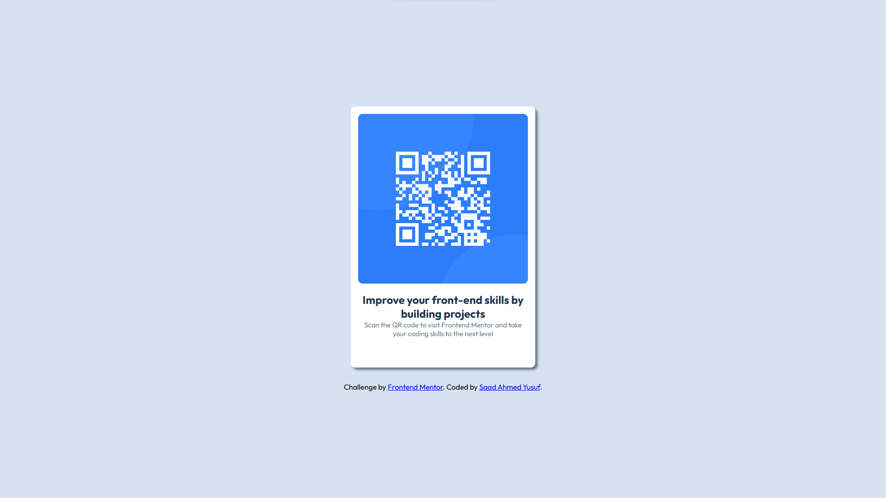

# QR Code Component – Frontend Mentor Challenge

This is my solution to the Frontend Mentor – QR Code Component challenge. The goal of this challenge is to build a simple, responsive card component containing a QR code and descriptive text.

# Overview

Users should be able to:

1. View the component at a responsive size on any device.

2. See a clean, centered QR code card with proper spacing and typography.

# Screenshot

# Links

Live Demo: [https://sourtik.github.io/QR-Code-Component/]
Code: [https://github.com/SourTik/QR-Code-Component]

Challenge by Frontend Mentor.
Designs provided by them; Code by me.
